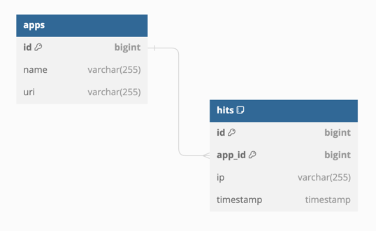
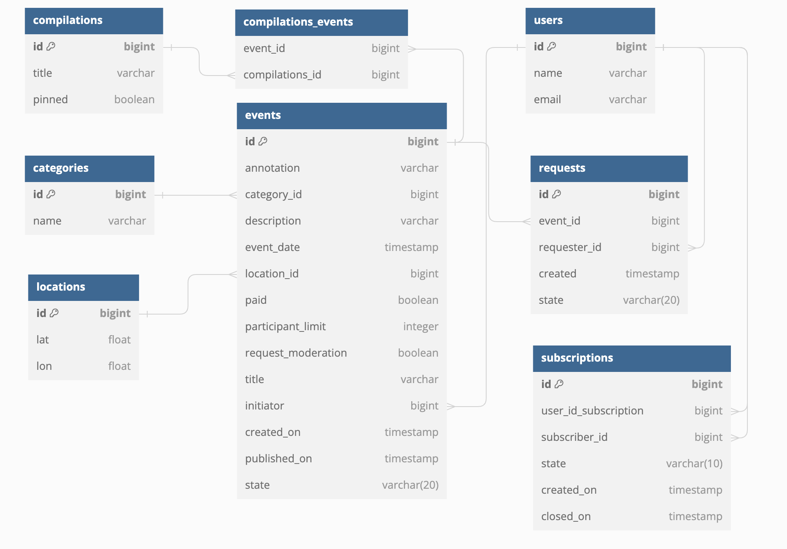

# java-explore-with-me

Ссылка на PR: https://github.com/dariyaLa/java-explore-with-me/pull/3

Схема базы данных сепвиса stats-service:

Схема базы данных сепвиса main-service: 

Функциональность фичи subscriptions: 

a. Для user добавлен параметр публичности профиля, по умолчанию для всех устанавливается true
b. Для user добавлен rest, позволяющий закрыть профиль, сделать приватным

1. добавление подписки  
1.1 если у пользователя открытый профиль (users.public_profile=true), подписка создается
автоматически со статусом ACTIVE, иначе OPEN. Когда пользователь ее одобрит, у подписки меняется статус с OPEN на ACTIVE.
Пока подписка не одобрена, подписчик не видит события пользователя
2. получение событий по своим подпискам (подписки одобрены)
3. получение событий по своим подпискам (подписки не одобрены)
4. получение списка подписок подписчиком
5. получение списка подписок пользователем, у которого запросили подписку
6. одобрение запрошенной подписки
7. закрытие подписки со стороны подписчика 
8. закрытие подписки со стороны пользователя

Проверки:
1. дублирование подписки
2. подписка на самого себя

